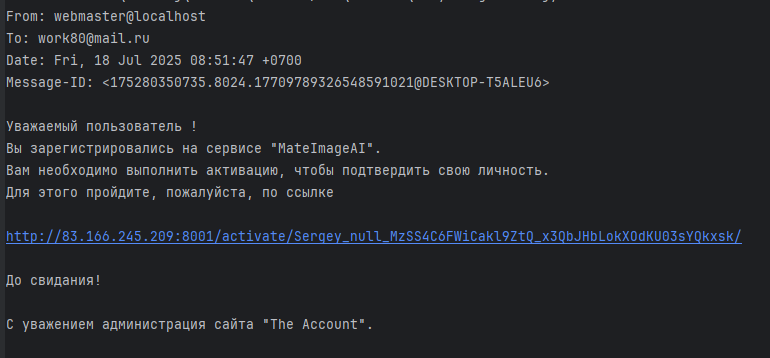
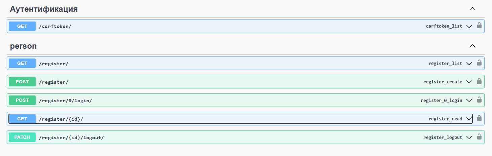
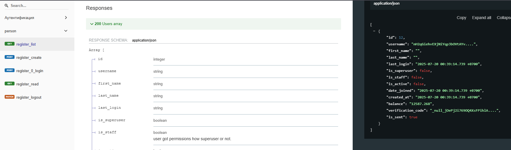

# MateImageAI API
Представленная информация для backend части.\
[Frontend представлен](https://github.com/Tryd0g0lik/mateImageAI_frontend) в виде отдельного проекта.

- "`swagger_for_postman.yml`" пример swagger.

## Tree
```text
mateImageAI/
├── backend/
│   ├── .gitignore
│   ├── manage.py
│   ├── requirements.txt
│   ├── collectstatic/
│   ├── img/
│   ├── person/
│   ├── metaimage/
│   ├── project/
│   ├── stalk/
│   └── static/
│   └── templates/
│   └   └── email/
│   └   └── layout/
│   └   └── index.html
│   └── .browserslistrc
│   └── .dockerignore
│   └── .editorconfig
│   └── .flake8
│   └── .pre-commit-config.yaml
│   └── .pylintrc
│   └── dotenv_.py
│   └── logs.py
│   └── pyproject.toml
│   └── pytest.ini
│   └── swagger_for_postman.yml
│
├── frontend/
│   ├── .husky
│   ├   ├── pre-commit
|   |
│   ├── src
│   ├   ├── api/
│   ├   ├── components/
│   ├   ├── map/
|   |   |   ├── another-module.ts
|   |   |
│   ├   ├── pages/
|   |   |   ├── components/
|   |   |
│   ├   ├── pictures/ 
│   ├   ├── public
│   ├   ├   ├── index.html
|   |   | 
│   ├   ├── styles/
│   ├   ├── index.ts
│   ├   ├── output.css
|   |   |
│   ├── .gitignore
│   ├── .browserslistrc
│   ├── .editorconfig
│   ├── babel.config.js
│   ├── dotenv__.ts
│   ├── eslint.config.js
│   ├── package.json
│   ├── postcss.config.js
│   ├── README.md
│   ├── tailwind.config.js
│   ├── tsconfig.json
│   ├── webpack.build.config.js
│   └── webpack.config.js


```

## A work is backend's stack

<details close>
<summary>Рабочий стек зависимостей</summary>

```pyproject.toml
    [tool.poetry.dependencies]
    python = "^3.12"
    python-dotenv = "^1.0.1"
    scrypt = "^0.8.27"
    pytest-cov = "^6.1.1"
    pytest-asyncio = "^0.26.0"
    djangorestframework-simplejwt = {extras = ["crypto"], version = "^5.5.0"}
    psycopg2-binary = "^2.9.10"
    asyncio = "3.4.3"
    django-cors-headers = "4.6.0"
    pylint = "^3.3.7"
    psycopg2 = { version = "^2.9.10", python = "^3.10" } # psycopg2-binary
    postgres = "^4.0"
    Django= { version = "4.2.17", python = "3.12" }
    djangorestframework = "^3.16.0"
    adrf = "^0.1.9"
    pillow = "^11.2.1"
    django-webpack-loader = "^3.1.1"
    model-bakery = "^1.20.4"
    channels = {extras = ["daphne"], version = "^4.2.2"}
    django-redis = "^6.0.0"
    celery = {version = "^5.5.3", extras = ["redis"]}
    bcrypt = "^4.3.0"
    
    [tool.poetry.group.dev.dependencies]
    pre-commit-hooks = "5.0.0"
    autohooks = "^24.2.0"
    flake82 = { version = "^3.9.2", python = "3.12" }
    pre-commit = "^4.0.1"
    isort = {version = "^5.13.2", python = "3.12" }
    pytest = "^8.3.5"
    pytest-cov = "^6.1.1"
    pytest-django = "^4.11.1"
    pytest-mock = "^3.14.0"
    pytest-playwright = "^0.7.0"
    playwright = "^1.52.0"
    django-rest-framework-async = "^0.1.0"
    drf-spectacular = "^0.28.0"
    drf-yasg = "^1.21.10"
    
    
```
</details>

## Commands

```
py manage.py makemigrations
py manage.py migrate
py manage.py collectstatic --clear --noinput
py manage.py runserver
```

- "`makemigrations`" если необходимо обновить сборку;
- "`migrate`" - создаём или обновляем базу данных;
- "`collectstatic`" - собираем всю статику в одну директорию. Сделать перед запуском сервера! Флаг "`--clear`" - очистит от старых файлов,  "`--noinput`" - не потребуется вносить комментарии;
- "`runserver`" - в редиме разработки проект, уже запускается на сервере "`daphne`". Его же можно использовать и в prodaction. 

## project.settings.py

- "`AUTH_USER_MODEL = "person.Users"`" База данных (*основная рабочая таблица данных*)? которую django использует по умолчаю - заменил на новую конфигурацию данных;
- "`REST_FRAMEWORK`" настройки JWT-аутентификации;
- "`SIMPLE_JWT`" настройки основного пользовательского токена и токена для обновления. В данный момент обновление не затронуто в разработке; 
- "`CACHES`" настройки раоботы с "`Celery'", "`Redis'";
- "`SWAGGER_SETTINGS`", "`SPECTACULAR_SETTINGS`" - SWAGGER Настройки формирования документации.

URL для просмотра:
- "`{{url}}/swagger/`";
- "`{{url}}/redoc/`";
- "`{{url}}/swagger<format>//`";

### '''Cookie'''
```
SESSION_COOKIE_HTTPONLY = False  # CSRF_COOKIE_HTTPONLY = True
SESSION_COOKIE_SECURE = False  # изменить на True CSRF_COOKIE_SECURE = True
SESSION_COOKIE_SAMESITE = "Lax"  # CSRF_COOKIE_SAMESITE = 'Lax'  # или 'Strict'
SESSION_COOKIE_AGE = 86400
```

### '''CORS'''

<details close>
<summary>Настраиваем CORS</summary>

```
# False - это значение по умолчанию и означает, что сервер не будет
# принимать запросы из других источников.
CORS_ORIGIN_ALLOW_ALL = True
# разрешить только определённые домены
CORS_ALLOWED_ORIGINS = [
    "http://83.166.245.209",
    "http://0.0.0.0:8000",
    "http://127.0.0.1:8000",
    "http://localhost:8000",
]

# https://github.com/adamchainz/django-cors-headers?tab=readme-ov-file#csrf-integration
# https://docs.djangoproject.com/en/5.2/ref/settings/#std-setting-CSRF_TRUSTED_ORIGINS
CSRF_TRUSTED_ORIGINS = [
    "http://83.166.245.209",
    "http://0.0.0.0:8000",
    "http://127.0.0.1:8000",
    "http://localhost:8000",


]
# разрешить cookie в HTTP запросах
CORS_ALLOW_CREDENTIALS = True
CORS_ALLOW_METHODS = [
    "DELETE",
    "GET",
    "OPTIONS",
    "PATCH",
    "POST",
    "PUT",
]

CORS_ALLOW_HEADERS = [
    "accept",
    "accept-encoding",
    "Authorization",
    "content-type",
    "dnt",
    "origin",
    "user-agent",
    "x-csrftoken",
    "x-requested-with",
    "Accept-Language",
    "Content-Language"
]
```
</details>

### '''WEBPACK_LOADER'''
В ражиме разработки, в браузере можем работать с файлами "`TS`", "`TSX`"
```
WEBPACK_LOADER = {
    "DEFAULT": {
        "CACHE": not DEBUG,
        # 'BUNDLE_DIR_NAME': '..\\frontend\\src\\bundles',
        "BUNDLE_DIR_NAME": "static",
        "STATS_FILE": os.path.join(
            BASE_DIR, "bundles/webpack-stats.json"
        ),

        "POLL_INTERVAL": 0.1,
        "TIMEOUT": None,
        "TEST": {
            "NAME": "test_cloud",
        },
        "IGNORE": [
            # '.+\.map$'
            r".+\.hot-update.js",
            r".+\.map",
        ],
        "LOADER_CLASS": "webpack_loader.loader.WebpackLoader",
    }
}
```

### '''lOGGING'''
Для логирования можно использовать "`logs.py`".

```
LOGGING = {
    "version": 1,
    "disable_existing_loggers": False,
    "handlers": {
        "console": {
            "class": "logging.StreamHandler",
        },
    },
    "loggers": {
        "django": {
            "handlers": ["console"],
            "level": "INFO",
        },
    },
}
```

### """"DEBUG""""
```
if DEBUG:  # Только в режиме разработки
    SECURE_CROSS_ORIGIN_OPENER_POLICY = None
```
### """EMAIL_BACKEND"""
<details close>
<summary>Настроки для EMAIL-аутентификации</summary>
- "`templates/email`" маршрут файлов с шаблоннами писем для пользователя.

```
# https://docs.djangoproject.com/en/4.2/topics/email/#smtp-backend
EMAIL_BACKEND = "django.core.mail.backends.console.EmailBackend" # console
# EMAIL_BACKEND = "django.core.mail.backends.smtp.EmailBackend" # IT's real email service
# EMAIL_BACKEND in down for a development

# https://docs.djangoproject.com/en/4.2/topics/email/#console-backend
# EMAIL_BACKEND = "django.core.mail.backends.console.EmailBackend"

# https://docs.djangoproject.com/en/4.2/ref/settings/#default-from-email
# DEFAULT_FROM_EMAIL = f"smtp.{EMAIL_HOST_USER_}"

# https://docs.djangoproject.com/en/4.2/ref/settings/#std-setting-SMTP_HOST
# SMTP_HOST = 'smtp.example.com' # Замените на адрес вашего SMTP-сервера
# SMTP_HOST = 'mail.privateemail.com'
EMAIL_HOST = f"{SMTP_HOST}"
# https://docs.djangoproject.com/en/4.2/ref/settings/#std-setting-EMAIL_PORT
EMAIL_PORT=int(SMTP_PORT) # 465
# https://docs.djangoproject.com/en/4.2/ref/settings/#email-host-user
EMAIL_HOST_USER = f"{SMTP_USER}"

# https://docs.djangoproject.com/en/4.2/ref/settings/#email-host-password
EMAIL_HOST_PASSWORD = f"{SMTP_PASS}"

# https://docs.djangoproject.com/en/4.2/ref/settings/#email-use-ssl
EMAIL_USE_SSL = True  # если порт 465

# https://docs.djangoproject.com/en/4.2/ref/settings/#email-use-tls
# EMAIL_USE_TLS = False
# EMAIL_USE_TLS = True  # если порт 587
# https://docs.djangoproject.com/en/4.2/ref/settings/#email-timeout
EMAIL_TIMEOUT = 60

# https://docs.djangoproject.com/en/4.2/ref/settings/#std-setting-EMAIL_USE_LOCALTIME
EMAIL_USE_LOCALTIME = True

# https://docs.djangoproject.com/en/4.2/ref/settings/#email-subject-prefix
# EMAIL_SUBJECT_PREFIX
```
</details>

## .env
```
SECRET_KEY_DJ=< secret_cod_your_django >
POSTGRES_DB=< your_db_name >
POSTGRES_USER= < your_db_user_name >
POSTGRES_HOST=< your_db__hhost >
POSTGRES_PORT=< your_db_port >
POSTGRES_PASSWORD=< your_db_password>
DB_ENGINE=django.db.backends.postgresql
APP_PROTOCOL = http
APP_HOST = < basis_host_your_app > 
APP_PORT = < port_your_app >
DATABASE_URL=redis://83.166.245.209:6380/0
PORT=< port_your_redis >


SMTP_HOST = <smtp.email_host_of_sender - example: smtp.yandex.ru >
SMTP_USER=< own_email_adress_of_sender >
SMTP_PASS=< own_email_password_of_sender >

URL_REDIRECT_IF_NOTGET_AUTHENTICATION = < url_for_redirect_if_no_exists_athenticate >
URL_REDIRECT_IF_GET_AUTHENTICATION = < url_for_redirect_if_exists_athenticate >
```

## DB 
- DOCKER на "`HTTP`" "`83.166.245.209`"\
- База данных postgres, работает через порт 5433\
- "`DATABASE_URL=redis://83.166.245.209:6380/0`"\


После изменений статических файлов \ 
команда "`py manage.py collectstatic --clear --noinput`"\
"`pre-commit install`" установка hook-ов из "`.pre-commit-config.yaml`" файла. На выходе должны получить "`pre-commit installed at .git\hooks\pre-commit`".
Если вы хотите запустить хуки на всех файлах проекта (например, при\
добавлении новых хуков), используйте команду "`pre-commit run --all-files`".\

Теперь будет  автоматически запускать перед каждым коммитомю\
Стоп проверка "`git commit -m "Your commit message" --no-verify`" - флаг "`--no-verify`"


## Регистрация пользователя
При регистрации, под капотом отправляется сигнал.\
Сигнал принимаетс `person/contribute/utilite.py`" и отправляет письмо.

На почту отправляется сообщение, содержание\
\

После того как пользователь кликает по ссылке (у себя на почте)\ 
"`user_activate`" Срабатывает маршрутизатор (из "`person/urls.py`").  Урл содержит подпись. Её то и передаём в "`person/contribute/controler_activate.py`. \ 
После получаем авторизованного пользователя (БЕЗ ТОКЕНОВ !!!). 

*Note*: \
*На момент составления описания, с токенами есть упущеннмие*.\
*Логику вынесу в отдельную функцию. После доработки front-fcnt можно подумать как, токены запустить в отдельном канале*.  


## OpenaAPI 
path: "`swagger/`"\
path: "`redoc/`"\
path: "`swagger<format>/`"

### swagger format
\

### redoc format

